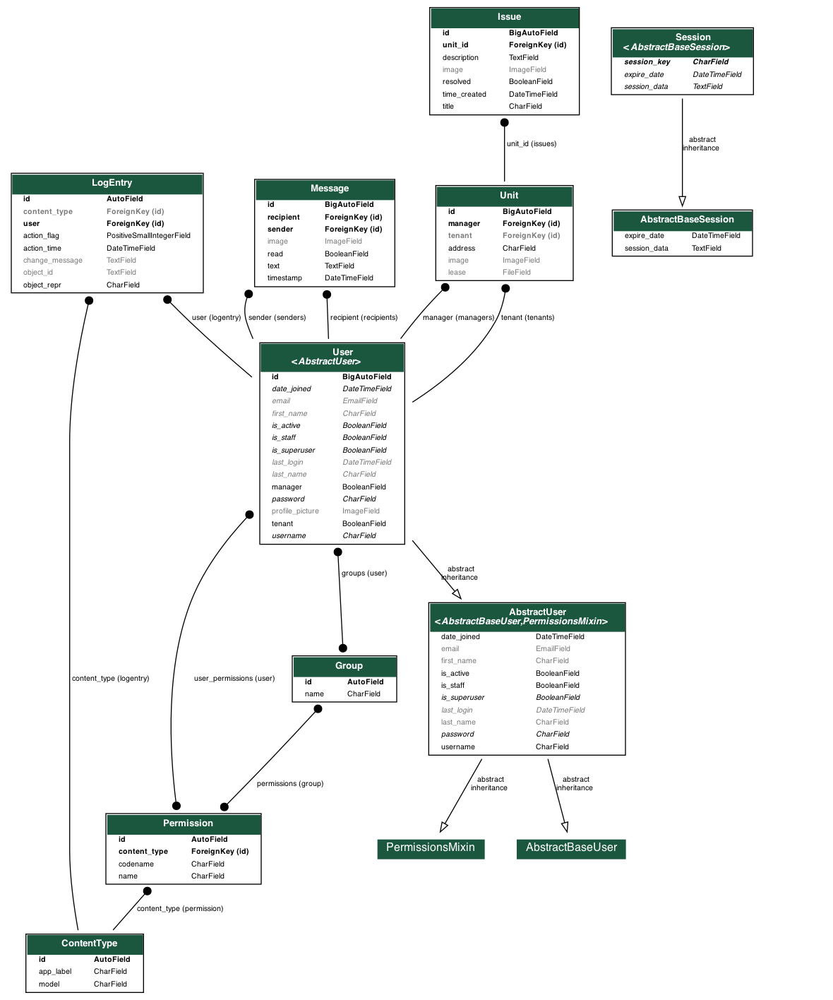
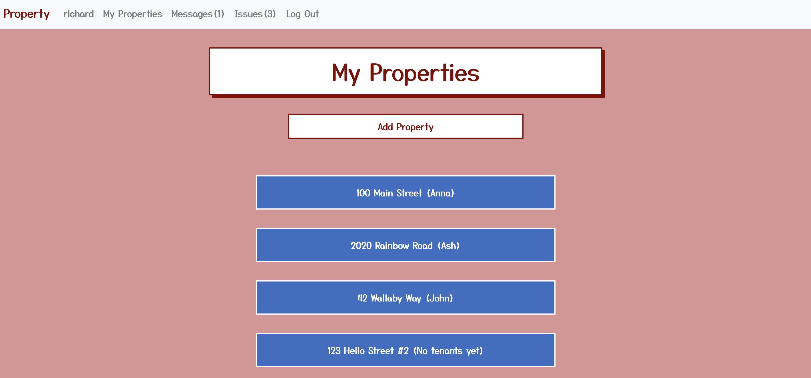
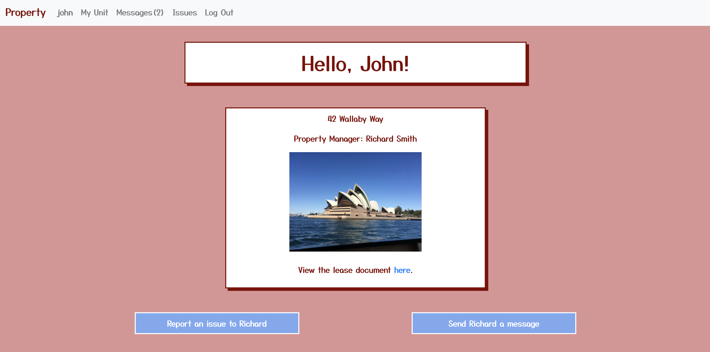
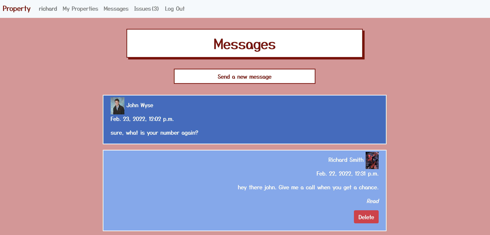

# Property

<a href="http://www.djangoproject.com/"></a>

[](https://forthebadge.com)

[](https://forthebadge.com)

## Table of Contents

  - [Overview](#overview)
  - [File Tree](#file-tree)
  - [Models](#models)
  - [Routes](#routes)
  - [How to Run](#how-to-run)
  - [Distinctiveness and Complexity](#distinctiveness-and-complexity)
  - [Next Steps](#next-steps)

## Overview [Back to Top](#property)

Property is a web app that connects property managers and tenants. After registering an account and connecting to a certain property, tenants and managers can message each other (with photos attached), managers can post lease documents, and tenants can report, update, and resolve maintenance issues. Users are alerted of unresolved issues and unread messages upon logging in. 

I was inspired to create this web app because of a desire for better communication with my own property manager. 

## File Tree [Back to Top](#property)

```
📦capstone
 ┣ 📂capstone
 ┃ ┣ 📜asgi.py - generated by Django
 ┃ ┣ 📜settings.py - whole project settings
 ┃ ┣ 📜urls.py - url routes for admin and property
 ┃ ┗ 📜wsgi.py - generated by Django
 ┣ 📂media - pdf and image file storage
 ┣ 📂property
 ┃ ┣ 📂migrations
 ┃ ┣ 📂static
 ┃ ┃ ┣ 📂property
 ┃ ┃ ┃ ┣ 📜favicon.png - favicon
 ┃ ┃ ┃ ┣ 📜index.js - dropdowns for send message and report issue forms for index.html
 ┃ ┃ ┃ ┣ 📜issues.js - edit issues, show textarea, send message and report issue dropdowns for unit_issues.html
 ┃ ┃ ┃ ┣ 📜messages.js - send message dropdown, mark messages as read, delete messages for unit_messages.html
 ┃ ┃ ┃ ┣ 📜notifications.js - gets and inserts counts for unread messages and unresolved issues for layout.html
 ┃ ┃ ┃ ┗ 📜styles.css - all CSS styling
 ┃ ┣ 📂templates
 ┃ ┃ ┣ 📂property
 ┃ ┃ ┃ ┣ 📜add_property.html - managers can add a new property/unit
 ┃ ┃ ┃ ┣ 📜error.html - error redirect for multiple errors
 ┃ ┃ ┃ ┣ 📜index.html - home page
 ┃ ┃ ┃ ┣ 📜issues.html - lists issue pages for managers
 ┃ ┃ ┃ ┣ 📜layout.html - base layout from which each layout extends, includes navbar
 ┃ ┃ ┃ ┣ 📜login.html - login page, all non-authenticated users redirect here
 ┃ ┃ ┃ ┣ 📜messages.html - lists message threads for managers
 ┃ ┃ ┃ ┣ 📜profile.html - shows a user their own profile info and picture
 ┃ ┃ ┃ ┣ 📜register.html - register a new user
 ┃ ┃ ┃ ┣ 📜unit.html - unit info is displayed
 ┃ ┃ ┃ ┣ 📜unit_issues.html - shows unresolved and resolved issues at a given unit
 ┃ ┃ ┃ ┗ 📜unit_messages.html - shows messages between managers and tenants
 ┃ ┣ 📜admin.py - generated by Django
 ┃ ┣ 📜apps.py - generated by Django
 ┃ ┣ 📜models.py - all four models (users, units, messages, issues)
 ┃ ┣ 📜tests.py - no tests yet
 ┃ ┣ 📜urls.py - url paths for property
 ┃ ┗ 📜views.py - all Python logic for property
 ┣ 📜db.sqlite3 - database
 ┣ 📜manage.py - generated by Python
 ┣ 📜readme.md - readme
 ┗ 📜requirements.txt - required packages to run app
 ```

## Models [Back to Top](#property)

There are four main models: Users, Units, Messages, and Issues.

All users are classified as either a manager or a tenant. Managers can be joined to multiple units, while tenants can be joined to only one unit. All html views are based on whether a user is a tenant or manager.

Units are joined to one manager and one tenant user. Units are created by managers and later claimed by tenants upon registration. Unit objects also contain image and pdf files related to the unit.

Messages are joined to users only and have a recipient and sender, which must be one tenant and one manager. Messages are also automatically marked as read or unread by an API call.

Issues are connected to units only and are marked as resolved or unresolved. Only tenants may officially change an issue's status to resolved.

#### Diagram



## Routes [Back to Top](#property)

#### index
The index or home route is called after successful login. For managers, all properties are displayed. For tenants, unit info is displayed as well as dropdown forms to report a new issue or send a message to their property manager.

Manager Home



Tenant Home


#### profile
The profile route renders a page that shows information about the user and gives an opportunity to upload a profile picture which then appears on messages.

Manager Profile


#### unit
The unit view is restricted to just property managers and shows a page similar to a tenant's home page, but specific to each unit managed.

#### messages, unit_messages
The messages view renders a page for managers that creates links to message threads with each active tenant. It also shows the number of unread messages in each thread. For tenants, the messages view redirects them to unit_messages for their specific unit.

The unit_messages view renders a page that shows all messages between a property manager and a specific tenant. It has pagination and displays 10 messages (and images if present) in reverse chronological order. It also displays if sent messages are read or unread by the recipient. Users can delete messages they have sent.

Unit Messages


#### issues, unit_issues
The issues view renders a page for managers that creates links to issues at each unit. It also shows the number of unresolved issues at each address. For tenants, the issues view redirects them to unit_issues for their specific unit.

The unit_issues view renders a page that shows all issues at a specific unit. Issues are designated as resolved or unresolved and color-coded. Only tenants can edit/update issues or change their status from unresolved to resolved or vice versa.

Unit Issues


#### add_property, report_issue, send_message

The add_property, report_issue, and send_message views all create model objects via POST from forms on the index, unit_issues, and unit_messages pages. 

#### add_tenant, change_resolved, add_profile_picture

The add_tenant, change_resolved, add_profile_picture views all edit model objects via PUT forms. Upon registration, new tenants slaim a property from a dropdown list of all "unclaimed" properties. Tenants can change the resolved status of their own issues. All users can add or update a profile picture attached to their user object.

#### login, logout, register

These views are edited from previous CS50W login and authentication distribution code. Registration is adjusted so users are either tenants or managers. 

#### API Routes

#### edit_issues
Users can edit issues as updates are needed. An API updates the issues description via PUT.

#### delete_message
Users can delete their own messages. Javascript starts a sliding animation after the API call.

#### mark_as_read
When a user loads a message thread, all of their received messages are marked as read via PUT when the DOM is loaded.

#### get_notifications
Each time the layout DOM is loaded, the user's unread message count and unresolved issues count (for managers only) is retrieved via GET. These counts are then inserted into the navbar.

## How to Run [Back to Top](#property)

1. Clone the repository.
2. Install Python and Django.
3. Install all packages from `requirements.txt`
4. Create your own Django secret key within settings.py
5. Run:
   ```python
   python manage.py runserver 
   ```
6. Visit the app locally in your browser. 

   - Click "Register" to create a new account and explore the app.

    or

   - Login as a manager:
     ```
     username: richard
     password: hello5
     ```
    
    or

   - Login as tenant: 
     ```
     username: john 
     password: hello5
     ```

## Distinctiveness and Complexity [Back to Top](#property)

The following features are distinct from all other CS50W projects:
- Mobile-Responsive: navbar toggles via Bootstrap and all styling resizes for mobile devices.
- File-Uploading: Images and pdfs can be directly uploaded, stored in the media folder, and accessed through the database.
- Animation: CSS and JavaScript implement animation/keyframes after deleting messages.
- Manager vs. Tenant views: each html page displays differently depending on whether the user is a property manager or tenant (all other projects had only one type of user).
- Property facilitates communication and reporting between certain users as opposed to all users.
- Property is significantly more complex in breadth and depth than the other projects. 


Complexity:
- Full CRUD capability
- Property implements four different JavaScript files across four different html files.
- Property includes four different models with additions to AbstractUser

## Next Steps [Back to Top](#property)

- Verification for connecting property managers and tenants: Ideally, property managers should send some sort of verification email or verification code to tenants before they can claim a unit.
- Multiple tenants at each unit: As of now only one tenant can be attached to each unit. This could be xpanded since multiple people could live in each unit. This would likely require another many-to-many model.
- More editing, adding features: The app could be improved if lease documents, images, messages, units, tenants, etc could be edited or deleted (ie when a new tenant moves into a unit)
- Urgency levels for issues: Sorting unresolved issues by urgency could improve user experience.
- Google Maps API: Units could pull an image using the Google Maps API.
- More specific error page messages.
- More testing needed.
