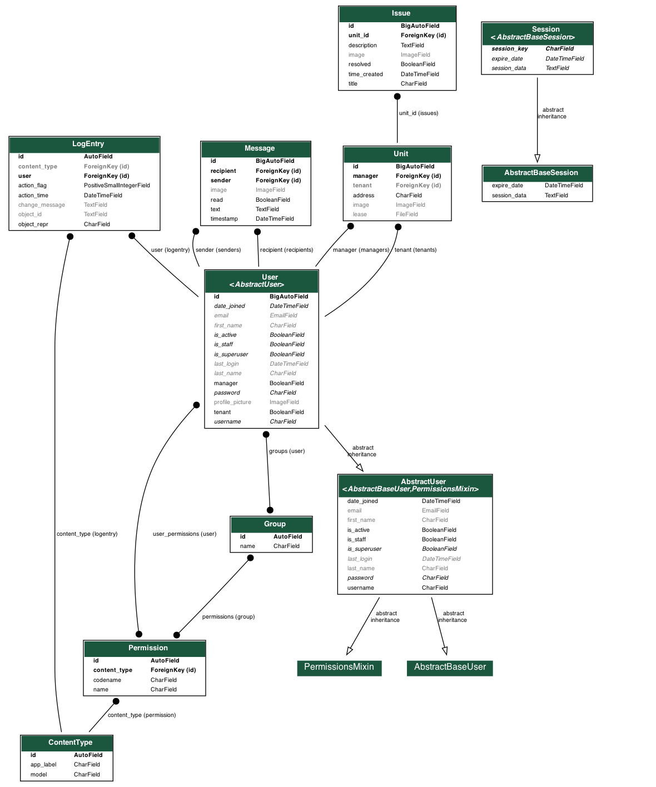

# Property

[](https://forthebadge.com)

[](https://forthebadge.com)

### Models
There are four main models: Users, Units, Messages, and Issues.

All users are classified as either a manager or a tenant. Managers can be joined to multiple units, while tenants can be joined to only one unit. All html views are based on whether a user is a tenant or manager.

Messages are joined to users only and have recipient and sender which must be one tenant and one manager. Messages are also automatically marked as read or unread by an API call.

Issues are connected to units only and are marked as resolved or unresolved. Only tenants may officially change an issue's status to resolved.




### File Tree

```
📦capstone
 ┣ 📂capstone
 ┃ ┣ 📜asgi.py
 ┃ ┣ 📜settings.py
 ┃ ┣ 📜urls.py
 ┃ ┗ 📜wsgi.py
 ┣ 📂media
 ┣ 📂property
 ┃ ┣ 📂migrations
 ┃ ┣ 📂static
 ┃ ┃ ┣ 📂property
 ┃ ┃ ┃ ┣ 📜favicon.png
 ┃ ┃ ┃ ┣ 📜favicon2.png
 ┃ ┃ ┃ ┣ 📜index.js
 ┃ ┃ ┃ ┣ 📜issues.js
 ┃ ┃ ┃ ┣ 📜messages.js
 ┃ ┃ ┃ ┣ 📜notifications.js
 ┃ ┃ ┃ ┣ 📜personal_styles.css
 ┃ ┃ ┃ ┣ 📜resume.pdf
 ┃ ┃ ┃ ┗ 📜styles.css
 ┃ ┣ 📂templates
 ┃ ┃ ┣ 📂property
 ┃ ┃ ┃ ┣ 📜add_property.html
 ┃ ┃ ┃ ┣ 📜error.html
 ┃ ┃ ┃ ┣ 📜index.html
 ┃ ┃ ┃ ┣ 📜issues.html
 ┃ ┃ ┃ ┣ 📜layout.html
 ┃ ┃ ┃ ┣ 📜login.html
 ┃ ┃ ┃ ┣ 📜messages.html
 ┃ ┃ ┃ ┣ 📜personal_index.html
 ┃ ┃ ┃ ┣ 📜profile.html
 ┃ ┃ ┃ ┣ 📜register.html
 ┃ ┃ ┃ ┣ 📜resume.html
 ┃ ┃ ┃ ┣ 📜unit.html
 ┃ ┃ ┃ ┣ 📜unit_issues.html
 ┃ ┃ ┃ ┗ 📜unit_messages.html
 ┃ ┣ 📜admin.py
 ┃ ┣ 📜apps.py
 ┃ ┣ 📜models.py
 ┃ ┣ 📜personal_urls.py
 ┃ ┣ 📜tests.py
 ┃ ┣ 📜urls.py
 ┃ ┗ 📜views.py
 ┣ 📜db.sqlite3
 ┣ 📜manage.py
 ┣ 📜readme.md
 ┗ 📜requirements.txt
 ```

